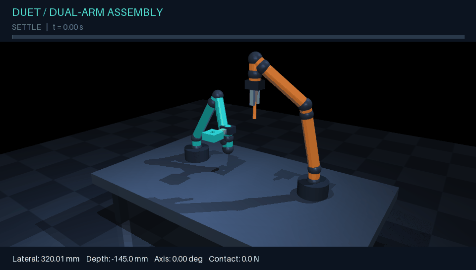

# DUET · MuJoCo Dual-Arm Assembly

**Two arms. One precise fit.** A runnable robotics simulation in which a teal
seven-joint arm holds a socket while an orange seven-joint arm inserts a peg.



A complete classical-control baseline: articulated robot models, Cartesian pose
control, a coordinated assembly sequence, physical peg/socket contacts, a force
abort, seeded trials, an interactive viewer, and experiment reports. No pretrained
weights, external meshes, ROS installation, or GPU training required.

## Run it

Use Python 3.11 or newer. On Windows, **double-click `launch-demo.bat`** to create
a virtual environment, install dependencies if needed, and launch the viewer.
The first launch requires an internet connection.

Or use PowerShell:

```powershell
git clone https://github.com/imjbassi/mujoco-dual-arm-assembly.git
cd mujoco-dual-arm-assembly
python -m venv .venv
.\.venv\Scripts\python.exe -m pip install -e ".[dev,record]"
.\.venv\Scripts\python.exe -m dual_arm_assembly demo
```

On Linux/macOS:

```bash
python3 -m venv .venv
source .venv/bin/activate
pip install -e '.[dev,record]'
python -m dual_arm_assembly demo
# macOS interactive viewer: use mjpython -m dual_arm_assembly demo
```

The following commands assume the virtual environment is active. In PowerShell,
you can always replace `python` with `.\.venv\Scripts\python.exe` without activating it.

## Try it

```bash
# Live simulation: SPACE pauses, R restarts, C switches camera, ESC closes.
python -m dual_arm_assembly demo
python -m dual_arm_assembly demo --camera closeup

# One fast trial without a graphics context; writes JSON, CSV, and an HTML report.
python -m dual_arm_assembly run --output runs/baseline

# Change the assembly location across reproducible seeds.
python -m dual_arm_assembly benchmark --trials 20 --seed 0

# Deliberately hit the rim: terminates with a force-limit failure (exit code 1).
python -m dual_arm_assembly run --offset-mm 12 --output runs/jam

# Render an annotated GIF and a final PNG; requires the record extra and OpenGL.
python -m dual_arm_assembly record --camera closeup --output runs/movie

# Export the complete, standalone MuJoCo scene.
python -m dual_arm_assembly export --output runs/scene.xml
```

Open `runs/baseline/report.html` for alignment, insertion-depth, and contact-force
plots. Reports are standalone HTML with no server or network dependencies.
`dual-arm` is also installed as a shorter command alias.

## What happens

| Phase | Simulated time | Behavior |
|---|---:|---|
| Settle | 0–0.75 s | Hold the initial pregrasped parts |
| Transfer | 0.75–3.75 s | Bring the socket and raised peg to the assembly station |
| Align | 3.75–5.25 s | Hold the peg 120 mm above the measured socket center |
| Insert | 5.25–9.25 s | Lower the peg smoothly through the bore |
| Hold | From 9.25 s | Require 0.5 s of continuously valid assembly geometry |
| Complete / abort | Terminal | Freeze the trial and save results |

Success requires lateral error below 3 mm, depth between 36 and 44 mm,
axis error below 2 degrees, and socket displacement from its target below 3 mm.
The square bore is 28 mm wide, the peg diameter is 20 mm, and the socket is 50 mm
deep. A correctly centered insertion can have **zero contact force** because of
the clearance. Depth is measured from the top of the socket to the peg tip.

The default force limit is 35 N. This is a simulation termination condition;
there is no physical emergency-stop controller or active recovery after a jam.

## How it works

Both original, primitive-only arms have seven revolute joints. Damped least-squares
inverse kinematics uses MuJoCo site Jacobians to command position and orientation.
The controller runs at 100 Hz and the physics engine at 500 Hz. Quintic motion
profiles produce smooth transfers. Joint position actuators have finite force
limits, with ideal link gravity compensation.

After transfer, the insertion arm follows the holder's measured socket position.
The peg and four socket walls use MuJoCo collision detection and contact dynamics.
Live joint positions are never overwritten during a trial; inverse kinematics
runs on separate scratch data. Only reset initializes joint configurations.

**Scope and assumptions:** this is an educational assembly baseline with exact
simulator state and ideal fixed grasps. The parts are rigidly attached to the
tools; fingers are visual, and grasp acquisition, slip, and release are not
modeled. Only peg/socket collisions are enabled. Links, grippers, table, and floor
are visual geometry, so this is not a collision-aware planner or a validated
model of a commercial robot. It does not include vision, RL, or hardware control.

Randomized trials vary the *known assembly location* by up to 25 mm in X, 20 mm in
Y, and 15 mm in Z. They do not test perception uncertainty or unknown part poses.
`--offset-mm` adds an intentional X bias to the peg target to exercise failures.
Reported contact force is the sum of peg/socket contact-force magnitudes, not a
six-axis wrist sensor reading.

## Project structure

```text
src/dual_arm_assembly/
  scene.py         Original MJCF robot and workcell generation
  control.py       Pose inverse kinematics and smooth interpolation
  simulation.py    State machine, physics stepping, metrics, failure checks
  reporting.py     JSON, CSV, standalone SVG/HTML reports
  cli.py           Viewer, benchmark, recording, model export
tests/             Physics, failure, reproducibility, and CLI integration checks
docs/              Design notes and generated demo media
.github/workflows/ GitHub Actions test/build matrix
```

## Validate

```bash
python -m pip install -e '.[dev]'
pytest -q
ruff check .
ruff format --check .
python -m build
```

The tests exercise successful randomized trials, real contact and a force abort,
rejection of an off-center insertion, reproducible reset, configuration validation,
MJCF compilation, and CLI report generation. GitHub Actions runs headless tests
on Windows and Linux with Python 3.11 and 3.13. See [validation notes](docs/VALIDATION.md)
for the initial local run; the configured CI matrix is separate from local evidence.

## Extend it

- Replace fixed tooling with free parts and actuated frictional grippers.
- Add collision geometry and a collision-aware motion planner for the arms.
- Add a wrist force/torque sensor and compliant insertion or spiral search.
- Estimate the socket pose from rendered RGB/depth images.
- Wrap the simulation in Gymnasium to compare a learned policy with this baseline.

See [architecture and tuning](docs/ARCHITECTURE.md). The simulation uses the
[official MuJoCo Python bindings](https://mujoco.readthedocs.io/en/stable/python.html)
and [MJCF model format](https://mujoco.readthedocs.io/en/stable/XMLreference.html).

## Troubleshooting

- **`No module named dual_arm_assembly`:** run `python -m pip install -e .` with the
  same Python interpreter used to launch the demo.
- **Viewer will not open:** the GUI needs a working desktop/OpenGL driver. Use
  `run` or `benchmark` for display-free simulation; recording still needs rendering.
- **macOS viewer error:** launch the interactive demo with `mjpython`.
- **Linux server recording:** configure MuJoCo's EGL/OSMesa backend and matching
  system drivers; these are not required for headless physics trials.
- **Failure exit code:** `run`, `record`, and `benchmark` return 1 for failed trials;
  invalid configuration returns 2. A deliberately jammed trial is expected to fail.

MIT licensed. Robot geometry and task code are original to this project.
